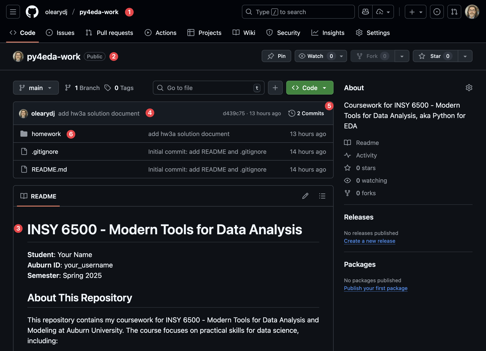

# HW3A - Git and Version Control

See Canvas for details on how to complete and submit this assignment.

## Introduction

This assignment introduces Git for version control and GitHub for sharing your work. You'll learn to manage multiple repositories, track your work's evolution, and build a public portfolio of your data science projects.

Software development is collaborative and iterative. Version control systems like Git are essential infrastructure for modern data science - they track changes, enable experimentation without fear of breaking things, facilitate collaboration, and make your work reproducible. GitHub has become the de facto platform for sharing code, with over 500 million projects and nearly every professional developer using it.

### Learning Objectives

- Clone and update repositories from GitHub to access course materials and references
- Initialize Git repositories and understand the three-stage workflow
- Track changes with commits and write meaningful commit messages
- Create professional documentation with README files and .gitignore
- Publish your work to GitHub and maintain a public portfolio
- Distinguish between repositories you own versus those you reference

By the end, you'll have a properly structured workspace with your own public repository that showcases your coursework. You'll understand the difference between consuming others' work (cloning) and sharing your own (pushing), and you'll have hands-on experience with the Git workflow that underpins modern software development.

This assignment should take 90-120 minutes to complete.

### Generative AI Allowance

You may use GenAI tools for brainstorming, explanations, and debugging if you disclose it, understand it, and validate it. Your submission must represent your own work and you are solely responsible for its correctness. GenAI tools are quite good at Git commands and explanations - use them thoughtfully.

### Scoring

- Exercises, Parts 1-4 (20 pts)
- Questions
    - Reflection (10 pts)
    - Git Concepts (10 pts, Grad Only)

### Submission Format

Unlike previous assignments, you will **not** submit a file. Instead, you will create a file locally, publish it on GitHub, and submit the URL of your public repository. This mirrors real-world practices where you develop locally and share your work on GitHub.

## Exercises (20 points)

### Prerequisites

Before starting, ensure you have:

- Completed lecture 7b, introducing Git and GitHub
- Your `insy6500` conda environment activated
- Terminal (macOS) or Git Bash (Windows) open
- Git installed (verify with `git --version`)

If Git is not installed, download and install it from [the git homepage](https://git-scm.com/).

### Part 1: Cloning and Exploring Repositories

The first step in using Git professionally is learning to work with repositories created by others. You'll clone the class repository for assignments and demos to use as a read-only reference that you can update periodically.

#### Task 1: Configure Git

Before making any commits, Git needs to know who you are. Run these commands with **your actual name and email**:

```bash
git config --global user.name "Your Name"
git config --global user.email "your.email@auburn.edu"
```

Verify your configuration:

```bash
git config --list
```

You should see your name and email in the output. If you want a more concise view:

```bash
git config user.name
git config user.email
```

You should also make `nano` the text editor used by git:

```bash
git config --global core.editor "nano"
```

#### Task 2: Clone the Class Repository

Navigate to your insy6500 directory and clone the class repository:

```bash
cd ~/insy6500
git clone https://github.com/olearydj/INSY6500 class_repo
```

Git will create a subdirectory called `class_repo` and download all the course materials into it. Explore what you've cloned:

```bash
cd class_repo
ls -la
tree -L 2  # If you installed tree in hw2a
```

Now examine the Git metadata (still in the `class_repo` folder):

```bash
git status
git log --oneline -10  # Shows last 10 commits
git remote -v  # Shows where this repo came from
```

The `remote` is the GitHub URL - this tells Git where to fetch updates from and where to push changes (though you don't have permission to push to the class repo).

Now, if you want to explore the class notebooks with Jupyter Lab, with the `insy6500` conda environment active run `jupyter-lab` from your project folder (`~/insy6500`). When JL opens in the browser, navigate to the `class_repo/notebooks` folder and open any of the IPYNB files.

### Part 2: Creating Your Portfolio Repository

Now you'll create your own repository for coursework. This is _your_ space - you have full control and will push your work here to build a public portfolio.

#### Task 1: Create Your Repository Directory

Create a directory for your personal course repository. We'll call it `my_repo` to distinguish your personal work (which you control and push to GitHub) from cloned reference repositories like `class_repo`:

```bash
cd ~/insy6500
mkdir my_repo
cd my_repo
```

Initialize it as a Git repository:

```bash
git init
```

This creates a hidden `.git` directory containing Git's database. Verify:

```bash
ls -la
git status
```

Git tells you you're on branch `main` with no commits yet.

#### Task 2: Create Repository Structure

Create a professional directory structure inside `insy6500/my_repo`:

```bash
mkdir homework projects notes
ls
```

Now check Git's perspective:

```bash
git status
```

Notice anything? Git shows nothing! Empty directories aren't tracked. Let's add content.

#### Task 3: Create a Professional README

Every good repository needs a README file. This is the first thing people see when they visit your repo on GitHub. Create it:

```bash
nano README.md
```

Copy-paste this template into the file and edit its contents (e.g. Student and Auburn ID):

````markdown
# INSY 6500 - Modern Tools for Data Analysis

**Student**: Your Name  
**Auburn ID**: Your Username  
**Semester**: Fall 2025

## About This Repository

This repository contains my coursework for INSY 6500 - Modern Tools for Data Analysis and Modeling at Auburn University. The course focuses on practical skills for data science, including:

- Python programming and scientific computing
- Data manipulation and analysis
- Statistical modeling and machine learning
- Reproducible research practices
- Version control and collaboration

## Repository Structure

- my_repo
  - homework: Assignment solutions
  - projects: Course projects and case studies
  - notes: Personal notes and experiments
  - README.md: This file

## Tools and Technologies

- **Python 3.x** via Anaconda
- **Jupyter Lab** for interactive development
- **Git/GitHub** for version control
- **Key libraries**: NumPy, Pandas, Matplotlib, Seaborn, Scikit-learn

## Course Information

- **Instructor**: Dan O'Leary
- **Institution**: Auburn University
- **Department**: Industrial & Systems Engineering
- **Course Repository**: [INSY6500](https://github.com/olearydj/INSY6500)

---

*This repository is maintained as part of my academic work and professional development in data science.*
````

Save with `Ctrl+O`, `Enter`, then exit with `Ctrl+X`.

Verify it was created:

```bash
cat README.md
```

#### Task 4: Create .gitignore

Not everything should be tracked by Git. Create a `.gitignore` file to exclude common Python/Jupyter artifacts:

```bash
nano .gitignore
```

Copy and paste these entries into the file:

```
# Jupyter Notebook
.ipynb_checkpoints/
*/.ipynb_checkpoints/*

# Python
__pycache__/
*.py[cod]
*$py.class
*.so
.Python

# Virtual Environments
env/
venv/
ENV/
conda-env/

# OS files
.DS_Store
Thumbs.db
```

Save and exit. This tells Git to ignore these files and directories, which would add unnecessary cruft to the repo.

#### Task 5: Initial Commit

Now let's take a snapshot of your repository. First, check what Git sees:

```bash
git status
```

You should see `README.md` and `.gitignore` as untracked files. Stage them:

```bash
git add README.md .gitignore
git status
```

Now they're in the staging area (ready to commit). Make your first commit:

```bash
git commit -m "Initial commit: Add README and .gitignore"
```

Verify it:

```bash
git log
```

The output should look something like this:

```text
commit 65aa5d61311a8b976232ec1992a4f71357fdedd1 (HEAD -> main)
Author: Dan O'Leary <oleary.dj@gmail.com>
Date:   Sat Oct 25 20:10:40 2025 -0400

    Initial commit: add README and .gitignore
```

The long alphanumeric string in the first line (`65aa5d6...` in this case) is a unique ID for the commit. Technically speaking, it is a **cryptographic hash** derived from the commit's entire content and context, making it more of a fingerprint than a serial number. Because each commit includes its parent's hash, the entire history is encoded. Changing anything in the past would change all future hashes. Hashes are widely used in computation, including:

- python sets and dictionaries use hashes to allow direct look-up [1] 
- cryptocurrencies rely on hashing to ensure the integrity of the blockchain
- file checksums and password storage

The hash (or, more commonly, the short form shown in `git log --oneline`) is used by git commands that refer to a specific commit, such as `git show <hash>` or `git diff <hash1> <hash2>`.

[1]: This is why set elements and dictionary keys must be immutable data types - changing them would change their hash value, breaking the lookup mechanism.

### Part 3: Professional Workflow Practice

Now you'll practice the complete workflow: make changes, commit them, and publish to GitHub. This mirrors how you'll work throughout the course.

#### Task 1: Create a GitHub Account

First, you need a GitHub account. If you don't already have one, go to [github.com](https://github.com) and create a free account. Follow the instructions and verify your email address.

Username tip: Choose something professional - this will be visible on your public portfolio. Many students use variations of their real name or Auburn username.

#### Task 2: Create Your First Assignment Solution

This assignment **is** your first assignment solution! Create a file to document what you've learned:

```bash
cd ~/insy6500/my_repo/homework
nano hw3a-solution.md
```

Add this content (feel free to expand with your own observations):

```markdown
# HW3A Solution - Git and Version Control

## Part 1: Repository Cloning

I successfully cloned the class repository from `https://github.com/olearydj/INSY6500` to `~/insy6500/class_repo`.

### Key Commands Used

- `git clone <url>` - Create local copy of remote repository
- `git log` - View commit history
- `git remote -v` - Check remote repository connections

## Part 2: Portfolio Repository Creation

I created my personal course repository with:

- Professional README.md describing the project
- Proper .gitignore to exclude unnecessary files
- Organized directory structure for homework, projects, and notes

### Understanding Git Workflow

The three-stage workflow:

1. Working Directory: Where I edit files
2. Staging Area: Where I prepare commits with `git add`
3. Repository: Where commits are permanently stored with `git commit`
```

Save and exit.

#### Task 3: Commit Your Solution

Now commit this work by following these steps in the `~/insy6500/my_repo` folder:

1. See what changed.

```bash
git status
```

2. Add the hw3a file.

```bash
git add homework/hw3a-solution.md
```

3. Verify it is staged.

```bash
git status
```

4. Commit the change.

```bash
git commit -m "Add hw3a solution document"
```

5. View the commit history.

```bash
git log --oneline
```

After the last command you should see something like this:

```text
d439c75 (HEAD -> main) add hw3a solution document
65aa5d6 Initial commit: add README and .gitignore
```

#### Task 4: Publish to GitHub

Now you'll create a repository on GitHub and push the contents of your `~/insy6500/my_repo` folder to it.

> Note: where the lecture described the use of the GitHub CLI for this step, for this assignment we'll use the GitHub web interface. This saves us the complexity of installing and configuring another tool, but requires that you carefully follow these instructions.

**Step 1: Create Repository on GitHub**

1. Go to https://github.com and log in
2. Click the **"+"** icon in the top-right corner
3. Select **"New repository"**
4. Configure your repository:
   - **Repository name**: `py4eda-work`
   - **Description**: "Coursework for INSY 6500 - Modern Tools for Data Analysis, aka Python for EDA"
   - **Configuration**: use all defaults. This will create an empty public repository.
5. Click **"Create repository"**

GitHub will show you a page with setup instructions for a variety of approaches. We'll use a variant of the last one, titled **"…or push an existing repository from the command line"**. 

**Step 2: Connect Your Local Repository to GitHub**

Make sure you are in your local repo directory...

```bash
cd ~/insy6500/my_repo
```

Then create the connection between your local `my_repo` folder and the `py4eda-work` repo on GitHub (be sure to replace `<USERNAME>` with the one you chose when creating your GitHub account):

```bash
git remote add origin https://github.com/<USERNAME>/py4eda-work.git
```

Finally, push the contents of `my_repo` to `py4eda-work`:

```bash
git push -u origin main
```

> Note on Authentication: When you run `git push` for the first time, you may be prompted to authenticate. Follow the prompts to authenticate via your browser, which will create a Personal Access Token. If you encounter issues with this step, ask for help.

You should see output showing your commits being uploaded to GitHub, something like this:

```text
Enumerating objects: 8, done.
Counting objects: 100% (8/8), done.
Delta compression using up to 16 threads
Compressing objects: 100% (7/7), done.
Writing objects: 100% (8/8), 1.92 KiB | 1.92 MiB/s, done.
Total 8 (delta 1), reused 0 (delta 0), pack-reused 0 (from 0)
remote: Resolving deltas: 100% (1/1), done.
To https://github.com/olearydj/py4eda-work.git
 * [new branch]      main -> main
branch 'main' set up to track 'origin/main'.
```

#### Task 5: Verify on GitHub

Refresh your repository page on GitHub. You should now see something like this:



1. In your `py4eda-work` repo
2. The repo is public
3. Your `README.md` rendered nicely and automatically displayed on the main page
4. Information about your latest commit
5. Commits - click this to see the history summarized
6. The repo structure and contents - only the `homework` folder is present as your `projects` and `notes` folders are still empty

Most of this interface is clickable - you can easily review the content of files and folders.

Your repository will be visible to all (public) at:

```
https://github.com/<USERNAME>/py4eda-work
```

For example, if your username is `olearydj`, the repo will be at `https://github.com/olearydj/py4eda-work`. We'll use this convention throughout the assignment.

#### Task 6: Practice the Update Workflow

Let's practice making changes after publishing. Update your hw3a-solution.md to add Part 3:

```bash
cd ~/insy6500/my_repo/homework
nano hw3a-solution.md
```

Copy the following content, paste it at the end of `hw3a-solution`, and edit it as necessary:

```markdown
## Part 3: GitHub Publishing

Successfully published repository to GitHub:

- Used `git remote add origin` to connect local repo to GitHub
- Used `git push -u origin main` to upload commits
- Verified all files and commits are visible on GitHub

### The Remote Connection

My local repository is now connected to GitHub:

- `git remote -v` shows the remote URL
- `git push` will send my commits to GitHub
- `git pull` will get updates from GitHub (if changes are made on GitHub)

### Details

Complete this section with details from your setup:

- Repository URL: ...
- Output of `git remote -v`:
- The output of `git log --oneline`:
```

Save the file and commit those changes:

```bash
git add homework/hw3a-solution.md
git commit -m "Complete Part 3 documentation"
```

Now push to GitHub - this time it's simpler since the connection is already established:

```bash
git push
```

Refresh your GitHub repository page in the browser - you should see the new commit!

### Part 4: Understanding Multiple Repositories

To recap the folders we're working with:

- `~/insy6500` - the root folder for all class materials, created during `hw2a`
- `~/insy6500/class_repo` ← clone of the class' GitHub repo
- `~/insy6500/my_repo` → pushes to your GitHub `py4eda-work` repo

Let's confirm these connections:

```bash
cd ~/insy6500/class_repo
echo "=== INSY6500 Repository ==="
git remote -v

cd ~/insy6500/my_repo
echo "=== Your Repository ==="
git remote -v
```

Other folders in `~/insy6500`, including `data`, `homework`, `projects`, `resources`, and `scripts` were created in `hw2a`. Feel free to reorganize things as you see fit, keeping in mind that anything you put in your repository (`~/insy6500/my_repo`) will be public.

**Never put any sensitive data in a github repo!**

Try this experiment in the INSY6500 repo:

```bash
cd ~/insy6500/class_repo
git push
```

What happens? You get an error! You don't have permission to push to the class repo. This is **expected and correct** - you can read but not write.

Now try it in your repo:

```bash
cd ~/insy6500/my_repo
git push
```

This works because it's your repository.

#### Task: Update Reference Repositories

Over time, I'll update the class repository with new assignments. You'll update your local copy like this:

```bash
cd ~/insy6500/class_repo
git pull
```

This fetches new commits from GitHub and merges them into your local copy. At this point it should say "Already up to date" since you just cloned them.

## Questions (20 points)

### Reflection Questions (10 points)

Answer the following questions in a new section at the end of your `hw3a-solution.md` titled "## Questions" with subheader "### Reflections":

#### Question 1: Git Workflow Benefits

You've now experienced the basic Git workflow: edit files, stage changes, commit with messages, and push to GitHub.

a) Before this assignment, how did you typically manage different versions of your work (e.g., assignments, code, documents)? Compare that approach to using Git. What are 2-3 specific advantages Git provides?

b) Describe a situation from your academic or professional work where Git's commit history would have been valuable. What problem would it have solved?

#### Question 2: Repository Organization

You now work with two repositories that serve different purposes:

- `class_repo` - cloned from the instructor, read-only reference
- `my_repo` - your own work, pushed to GitHub

a) Explain why it's important to keep these separate. What would happen if you tried to put everything in one repository?

b) Think about your future coursework or projects. Describe how you might organize multiple repositories. For example, how would you handle a group project versus individual assignments versus reference materials?

#### Question 3: Commit Messages and History

Look at the commit messages you wrote during this assignment (use `git log --oneline` if needed).

a) Compare these two commit messages:

   - "update"
   - "Add hw3a solution documenting Git workflow and repository structure"
   
   Which is more useful? Why? When might you need to find this commit again in the future?
   
If you would like to learn more about best practices for these important messages, you might be interested in:

- The [Conventional Commits specification](https://www.conventionalcommits.org/en/v1.0.0/) - a popular convention where commits start with prefixes like `feat:`, `fix:`, `docs:` to enable automation
- [How to Write a Git Commit Message](https://cbea.ms/git-commit/) - a comprehensive guide to writing effective commit messages

b) Imagine you're working on a data analysis project over several weeks. Describe how you would decide when to make a commit. What makes a good "unit of work" for a single commit?

### Understanding Git Concepts (10 points, Graduate Only)

Graduate students: Add a sub-section titled "### Graduate Questions" with concise answers to the following:

#### Question 1: The Three-Stage Model

Git uses three stages: Working Directory → Staging Area → Repository. Many version control systems skip the staging area and commit all changes directly.

Without a staging area, you'd have to commit everything at once with a message like "various updates" - making it hard to understand your history later. The staging area lets you **review and organize** your changes before committing, creating a clean, understandable history where each commit represents one logical change.

a) Think about the work you did in this assignment. You created README.md, .gitignore, and hw3a-solution.md. Why was it valuable to commit the README and .gitignore together first, then commit hw3a-solution.md separately later? What would have been lost if you'd committed everything at once?

b) Imagine you're working on a homework assignment over several days. You:
   - Write code to load data
   - Start working on a new analysis function (half-finished)
   - Fix a typo in a comment
   - Update your README
   
   Which of these changes should you commit now, and which should you wait on? Why? How does staging help you make this decision?

c) Explain how `git status` helps you make decisions about what to stage and commit. When in your workflow should you use it?

#### Question 2: Local vs. Remote Repositories

You experienced both local repositories (on your computer) and remote repositories (on GitHub).

a) Git is described as a "distributed" version control system. Based on your experience with `class_repo` and `my_repo`, explain what this means. How is it different from just storing files in Google Drive or Dropbox?

b) You can work on your local repository (`my_repo`) even without an internet connection - making commits, viewing history, etc. Then later you can `git push` to sync with GitHub. Explain why this architecture is valuable for developers. What workflows does it enable?

c) Describe the relationship between `git clone`, `git pull`, and `git push`. Why can you `pull` from `class_repo` but not `push` to it, while your `my_repo` allows both?

#### Question 3: Professional Portfolio

You've created a public repository on GitHub that will be visible to potential employers or collaborators.

a) Throughout the remainder of this course, you'll add more work to this repository. What should you consider when deciding what to commit? How do you balance showing your work process (including mistakes and iterations) versus presenting polished final products?

b) Your README.md is the first thing people see when they visit your repository. What makes a README effective for a portfolio repository versus a README for an open-source project someone might want to use?

c) Reflect on the value of building this public portfolio during your coursework rather than waiting until you're job searching. What habits should you develop now to make this portfolio valuable later?

## Submission

Follow the instructions on Canvas to submit the URL to your public GitHub repository in the Canvas assignment. The URL should look like:

```
https://github.com/<USERNAME>/py4eda-work
```

**Before submitting, verify:**

- [ ] Your repository is **public** (check Settings → General → Danger Zone)
- [ ] Your README.md displays correctly on the main page
- [ ] Your homework/ directory contains hw3a-solution.md
- [ ] All your commits are pushed (refresh the page to check)
- [ ] Graduate questions are answered (if applicable)

Your repository should contain:

```
py4eda-work/
├── homework/
│   └── hw3a-solution.md
├── projects/
├── notes/
├── .gitignore
└── README.md
```

**Note**: You can continue to commit and push even after submitting the URL. I will review whatever is there at the deadline. This is one advantage of GitHub-based submission - you can iterate!


## Troubleshooting

**Problem**: `git push` asks for username/password repeatedly  
**Solution**: Run `gh auth login` again and choose the browser authentication

**Problem**: Repository won't publish because name already exists  
**Solution**: Choose a different repository name or delete the existing one on GitHub first

**Problem**: Made a mistake in a commit message  
**Solution**: For the most recent commit: `git commit --amend -m "New message"`

**Problem**: Accidentally committed files you didn't want  
**Solution**: Before pushing: `git reset HEAD~1` (removes last commit, keeps changes)

**Problem**: Lost track of which directory you're in  
**Solution**: Use `pwd` and `git status` frequently to orient yourself

**Need more help?** Use `tldr git`, ask your favorite LLM, or refer to the lecture materials!
